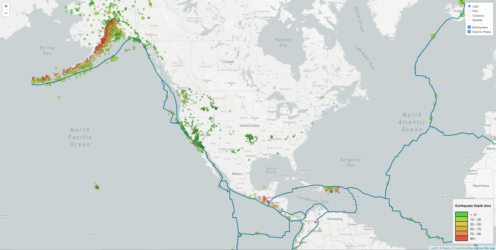
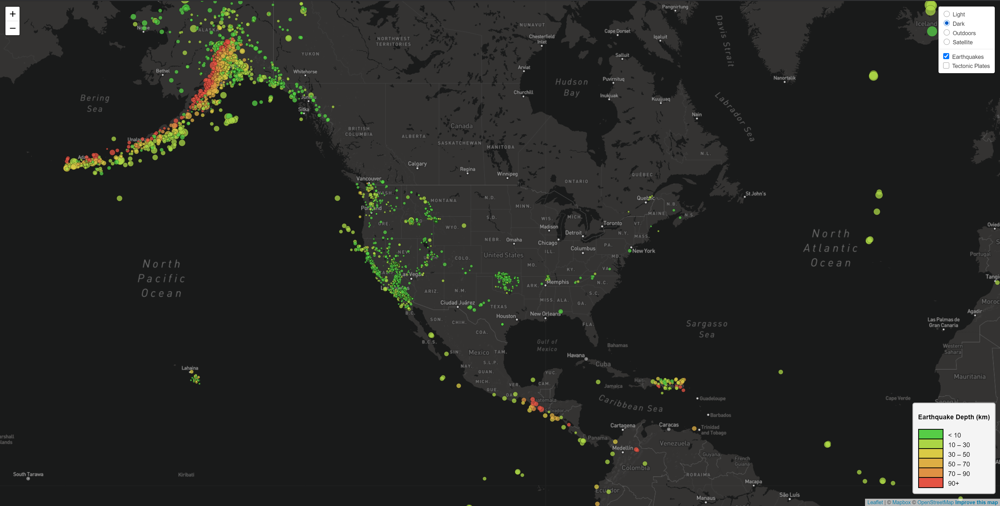
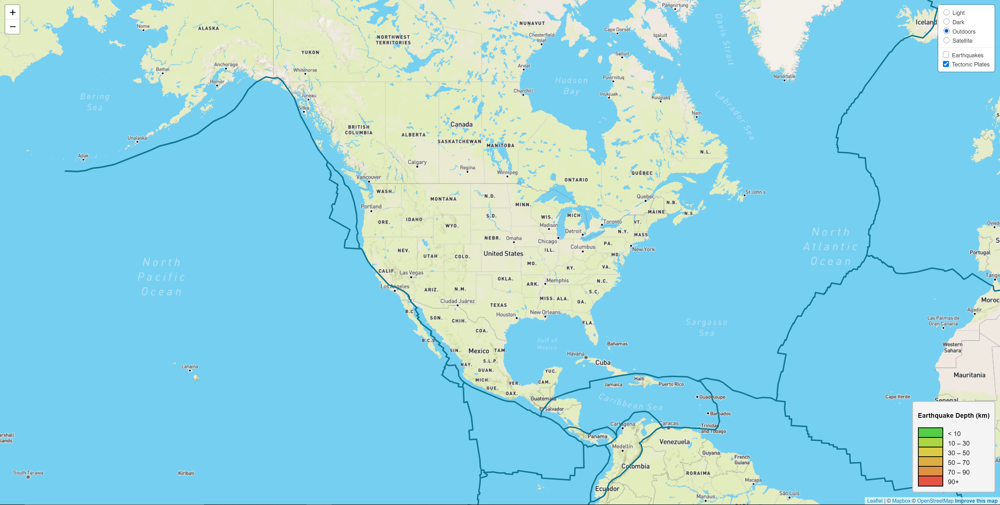

# Leaflet-USGS-EQ-Map
Recreating the USGS Earthquake map with Leaflet, HTML, CSS, and JS.

## Background

Welcome to the United States Geological Survey, or USGS for short! The USGS is responsible for providing scientific data about natural hazards, the health of our ecosystems and environment; and the impacts of climate and land-use change. Their scientists develop new methods and tools to supply timely, relevant, and useful information about the Earth and its processes. As a new hire, you will be helping them out with an exciting new project!

The USGS is interested in building a new set of tools that will allow them to visualize their earthquake data. They collect a massive amount of data from all over the world each day, but they lack a meaningful way of displaying it. Their hope is that being able to visualize their data will allow them to better educate the public and other government organizations (and hopefully secure more funding) on issues facing our planet.

## Your Task

### Level 1: Basic Visualization

Your first task is to visualize an earthquake data set.

1. **Get your data set**

   The USGS provides earthquake data in several different formats, updated every 5 minutes. Visit the [USGS GeoJSON Feed](http://earthquake.usgs.gov/earthquakes/feed/v1.0/geojson.php) page and pick a data set to visualize. When you click on a data set, for example 'All Earthquakes from the Past 7 Days', you will be given a JSON representation of that data. You will be using the URL of this JSON to pull in the data for our visualization.

2. **Import & Visualize the Data**

   Create a map using Leaflet that plots all the earthquakes from your data set based on their longitude and latitude.

   * Your data markers should reflect the magnitude of the earthquake by their size and depth of the earthquake by color. Earthquakes with higher magnitudes should appear larger and earthquakes with greater depth should appear darker in color.

   * **HINT** the depth of the earth can be found as the third coordinate for each earthquake.

   * Include popups that provide additional information about the earthquake when a marker is clicked.

   * Create a legend that will provide context for your map data.

   * Your visualization should look something like the map above.

- - -

### Level 2: More Data (Optional)

The USGS wants you to plot a second data set on your map to illustrate the relationship between tectonic plates and seismic activity. You will need to pull in a second data set and visualize it alongside your original set of data. Data on tectonic plates can be found at <https://github.com/fraxen/tectonicplates>.

**HINT** this dataset is in a GeoJSON format that allows us to utilize a GeoJSON Layer type in [Leaflet](https://leafletjs.com/reference-1.7.1.html#geojson)

In this step we are going to..

* Plot a second data set on our map.

* Add a number of base maps to choose from as well as separate out our two different data sets into overlays that can be turned on and off independently.

* Add layer controls to our map.

## Additional

If you wish to use the code already in this repository, you will need to complete the following steps:

* Head to [Mapbox](https://www.mapbox.com/) and create an account. Follow the steps to create a new access token or use the default public token they provide.

* Create a file called `config.js` at the following location:

	* `/static/js/config.js`

	* Inside this file, write the following script:

		* ```javascript
		  // API Key
		  const API_KEY = “YOUR ACCESS TOKEN”;
		  ```
	* Replace `”YOUR ACCESS TOKEN”` with the token you created after signing up for Mapbox.

## Images of final product








